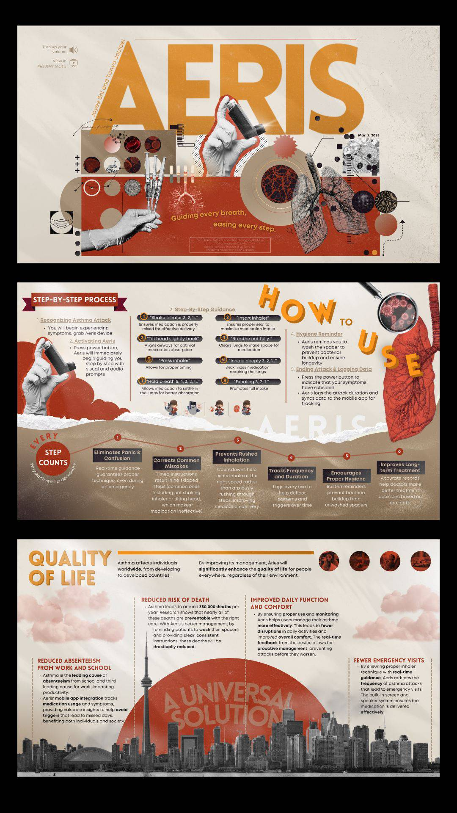

# 🚀 Daily Challenge 5 – Sheryians Coding School  

A visually rich and immersive **Aeris Concept Website** focused on **asthma care guidance and awareness**.  
The project presents a **story-driven, editorial-style layout** with layered visuals and strong typography, built using **HTML & SCSS only**.

## ✨ Features  

| 🌟 Feature | 💡 Description |
|:-----------|:----------------|
| 🫁 Medical Concept UI | Healthcare-focused interface centered around asthma care and inhaler guidance |
| 🎨 Artistic Layout | Magazine-style design with layered images, shapes, and bold typography |
| 🧭 Guided Flow | Step-by-step visual explanation of how to use the Aeris device |
| 🖼️ Visual Storytelling | Rich use of medical imagery, illustrations, and abstract elements |
| 📐 CSS Grid & Flexbox | Complex layouts implemented using modern CSS Grid and Flexbox |
| 🧩 Multi-Section Design | Clearly divided pages for introduction, usage process, and impact |
| 🔤 Custom Typography | Multiple fonts used to establish hierarchy and visual identity |
| 🌈 Color-Driven UI | Warm medical tones with strong contrast and depth |
| 🧱 No JavaScript | Entire project built using only HTML and SCSS |
| 🖥️ Desktop-Focused | Optimized for large screens and concept showcase |

## 🖼️ Preview  

### 🔹 Design Inspiration  
Inspired by **conceptual medical and product presentation designs**, focusing on visual clarity and storytelling.

  

### 🔹 Final Output  
The final build translates the concept into a **structured HTML & SCSS implementation** with layered visuals and strong layout control.

## 🧠 Learning Outcome  
Gained hands-on experience with **advanced layout composition**, **SCSS structuring**, and **design-to-code translation**.  
Learned to manage complex visual hierarchies using only HTML and SCSS.

## 🙌 Acknowledgement  
This project was created as part of **Sheryians Coding School — Cohort 2.0 (Daily Challenge 5)**.

---
